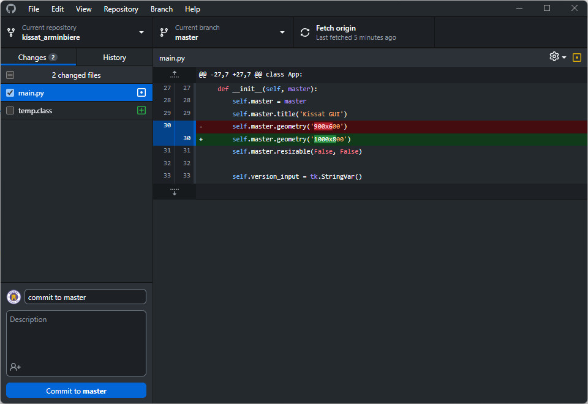

Đề bài :

Hướng dẫn này nhằm hướng tới việc giúp bạn có thể tạo mới 1 repo trên 1 git server như Github/Gitlab, clone repo về local, pull/push code giữa local và server.

1. Đăng ký 1 tài khoản trên [Github](http://github.com/) (có thể dùng [Gitlab](http://gitlab.com/) cũng tương tự), nếu có rồi thì bỏ qua bước này.
2. Tải và cài đặt Github Desktop tại [đây](https://desktop.github.com/)
3. Cài đặt hoàn tất, mở Github Desktop, click chọn **Clone a repository from the Internet**, click chọn **Sign in**, sau đó đăng nhập theo tài khoản Github của mình (đã đăng ký tại bước đầu tiên).

    

4. Sau đó chọn đúng repo mình muốn clone về local, chọn nơi sẽ lưu repo tại local, và click **Clone**.

    

5. Trong trường hợp bạn đã clone repo từ trước đó (sử dụng cmd or others), chọn **File -> Add local repository**, chọn tới folder chứa repo tại local (folder chứa thư mục .git).

    

6. Với các lần sau:

    - Đảm bảo đã chọn đúng repo, tại trên cùng bên trái **Current repository**

    Chọn **Fetch origin** tại bên phải trên cùng, nếu có xuất hiện **Pull origin**, click để pull change từ server về.

    

    - Sau khi đã thay đổi mã nguồn và mong muốn commit lên server, bạn hãy chọn các file thay đổi (bỏ tick những file không push lên, ví dụ như file .class). Thêm commit message, chọn 'commit to master' ở dưới.

    

    - click chọn **push origin** để push lên server

    

    - Cuối cùng lên http://github.com để kiểm tra commit của mình.