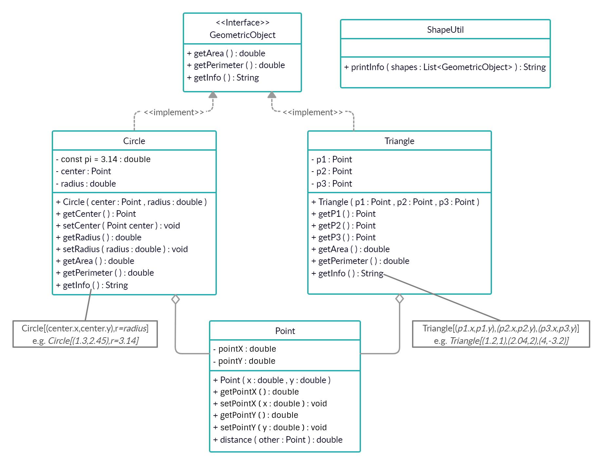
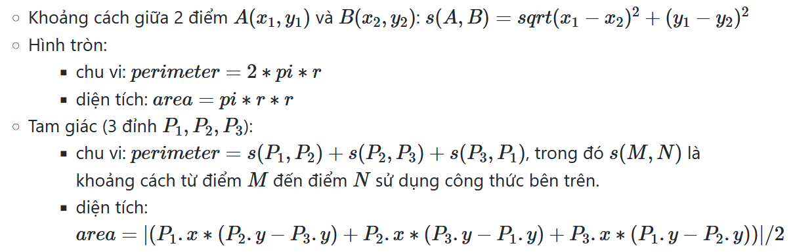
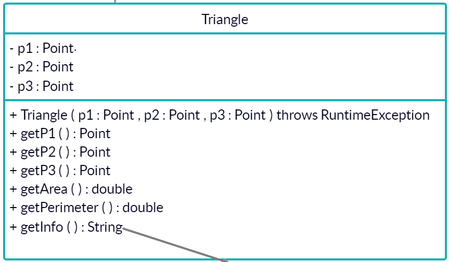

### Đề bài :

## Bài kiểm tra số 2

Cài đặt các interface, class **GeometricObject**, **Point**, **Circle**, **Triangle**, **ShapeUtil** tuân theo biểu đồ lớp dưới đây:



1. Tạo các lớp, thuộc tính, getter, setter, constructor như biểu đồ lớp. _Lưu ý có thể đặt thêm các phương thức khác để phục vụ mục đích riêng, tuy nhiên lớp **Triangle** không có 3 phương thức setP1(), setP2(), setP3()._

2. Phương thức _getInfo()_ trả về _String_ có dạng mô tả như chú thích trong hình. Chú ý: - ví dụ ở dòng thứ 2 (e.g. ...); - String trả về không có chứa dấu cách (space); - không xáo trộn thứ tự 3 điểm với lớp **Triangle**; - các số thực được in ra với 2 chữ số thập phân sau dấu phẩy. Ví dụ **3.14159 => 3.14; 3.14559 => 3.15**. Gợi ý sử dụng phương thức `java String.format("%.2f", input)`.

3. Lớp **Circle** khai báo hằng số _PI_ nhận giá trị 3.14; và sử dụng hằng số này cho tính diện tích hình tròn.

4. Lớp **ShapeUtil** có phương thức _printInfo_ trả về thông tin của _List\<GeometricObject\>_ theo nhóm **Circle** và **Triangle**. Cụ thể như sau:

    ```
    Circle:
    Circle[(1,2),r=3]
    Circle[(5,6),r=2]
    Triangle:
    Triangle[(1,2),(2,3),(3,0)]
    Triangle[(-1,-3),(-5,3),(0,0)]
    ```
    &ast;Lưu ý **Circle** luôn nằm trước **Triangle**&ast;

5. Một số công thức toán học cần nhớ:

   

6. Khi khởi tạo tam giác với 3 điểm đầu vào, có thể xảy ra ngoại lệ: có 2 điểm trùng nhau, 3 điểm thẳng hàng. Vì vậy, hãy sửa đổi phương thức khởi tạo 3 tham số của lớp **Triangle**; cụ thể cho _throws RuntimeException_ khi xảy ra trường hợp trên. Theo dõi hình dưới:

    

### Định dạng đầu vào :

1. Các file .java nộp lên **không định danh package** trong đó (bỏ tất cả dòng pakage)
2. Tất cả **file .java** đặt **cùng trong một folder** và được nén lại dưới đuôi .zip
3. **Tên folder** chứa các **file .java** không được chứa ký tự đặc biệt hoặc ký tự khoảng trắng.

### Source code mẫu :

None

### Điều kiện :

None