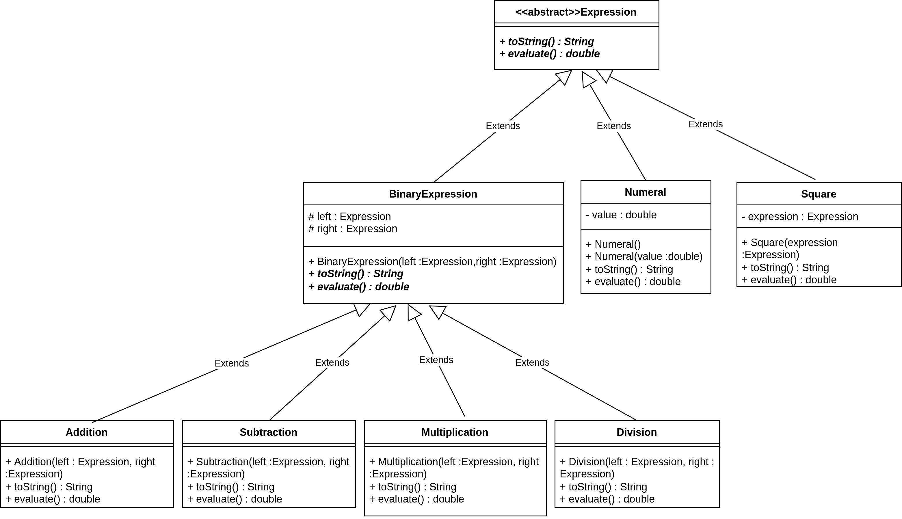

### Đề bài :

Trong Java, ngoại lệ - exception là một sự kiện mà phá vỡ luồng chuẩn trong quá trình thực hiện của chương trình. Nhiệm vụ của ta – người phát triển chương trình là cẩn xử lý ngoại lệ, thay vì chương trình “chết” thì chủ động xử lý để nó có thể tiếp tục bình thường. Để dễ tiếp cận, hãy xem xét ví dụ đơn giản dưới đây.

```java
public class HelloException {
   public static void main(String[] args) {
      // Phép chia này không có vấn đề
      double value = 4 / 2;
      System.out.println("Value = " + value);

      // Phép chia này có vấn đề, vì chia cho 0
      // Lỗi đã xảy ra tại đây.
      value = 2 / 0;

      // 2 dòng code dưới đây sẽ không được thực hiện
      System.out.println("New value = " + value);
      System.out.println("Exit!");
   }
}
```

Khi thực thi đoạn code này, kết quả thu được như sau:

```
Value = 2  
Exception in thread "main" java.lang.ArithmeticException: // by zero  
at exception.HelloException.main(HelloException.java:12)
```

Trong ví dụ này, lỗi xảy ra khi thực hiện phép chia cho 0. Phép chia cho 0 làm chương trình “ném” ra ngoại lệ, “chết” ngay tại dòng này, dẫn tới 2 câu lệnh cuối cùng không được thực hiện. Tiến hành sửa đổi đoạn code thành như dưới đây, và chạy lại chương trình, ta sẽ thấy chương trình không báo “lỗi”, câu lệnh cuối đã được thực hiện.

```java
public class HelloException {
    public static void main(String[] args) {
        // Phép chia này không có vấn đề
        double value = 4 / 2;
        System.out.println("Value = " + value);
        
        try {
            value = 2 / 0;
            System.out.println("New value = " + value);
        } catch (ArithmeticException e) {
            // Các dòng code trong khối catch được thực thi
            System.out.println("An exception");
            System.out.println("Error: " + e.getMessage());
        }
        // Dòng code dưới đây chắc chắn sẽ được thực hiện
        System.out.println("Exit!");
    }
}
```

Ở đoạn code sửa đổi phía dưới, ta đã chủ động đặt đoạn code có thể xảy ra lỗi (thực hiện phép chia) vào trong khối try-catch. Vì vậy khi ngoại lệ được “ném” ra, đoạn code trong khối catch sẽ được thực thi, sau đó tiếp tục với các lệnh còn lại.

Ví dụ xử lý ngoại lệ bên trên có thể sửa đổi thành dạng “chuẩn hơn” như dưới đây. Thông thường, hàm chứa đoạn code có thể xảy ra ngoại lệ sẽ “ném” ra ngoại lệ. Và hàm gọi tới chúng sẽ xử lý chúng bằng cách try-catch hoặc tiếp tục “ném ra ngoại lệ” để hàm “gọi tới nó” xử lý.

```java
public class HelloException {

    // phương thức này "ném" ra ngoại lệ, phương thức gọi tới cần xử lý
    public static double divide(double a, double b) throws ArithmeticException {
        return a/b;
    }

    public static void main(String[] args) {
        try {
            value = divide(2 ,  0);
            System.out.println("New value = " + value);
        } catch (ArithmeticException e) {
            System.out.println("An exception");
            System.out.println("Error: " + e.getMessage());
        }
        System.out.println("Exit!");
    }
}
```

**Yêu cầu:** Dựa trên hướng dẫn phía trên, hãy hoàn thành các yêu cầu dưới đây

Cài đặt các lớp như trong hình dưới đây.



a. Đặt modifier abstract cho các lớp và phương thức thích hợp

b. Cài đặt các phương thức **evaluate()** và **toString()** thích hợp cho các lớp. Dưới đây là ví dụ kết quả phương thức **toString()** cho biểu thức _(10^2 - 3 + 4*3)^2_.

((((10) ^ 2 + -3) + (4 * 3))) ^ 2

c. Viết lớp **ExpressionTest** để thử, trong đó tạo biểu thức _(10^2 - 3 + 4*3)^2_ và tính kết quả, in ra màn hình. Chú ý: không cần nhập dữ liệu từ tệp ngoài hoặc xử lý xâu kí tự chứa biểu thức.

d. Bổ sung các lớp **Subtraction** (trừ), **Multiplication** (nhân), và **Division** (chia). Sau đó, sửa lớp **ExpressionTest** để chạy thử.

e. Xử lý ném ngoại lệ **java.lang.ArithmeticException** với nội dung “**Lỗi chia cho 0**” khi thực hiện phép chia cho 0 ở phương thức **evaluate()** của lớp **Division**

### Định dạng đầu vào :

1. Các file .java nộp lên **không định danh package** trong đó (bỏ tất cả dòng pakage)
2. Tất cả **file .java** đặt **cùng trong một folder** và được nén lại dưới đuôi .zip
3. **Tên folder** chứa các **file .java** không được chứa ký tự đặc biệt hoặc ký tự khoảng trắng.

### Source code mẫu :

None

### Điều kiện :

None