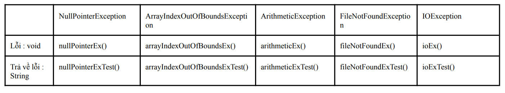

### Đề bài :

Tạo các phương thức gây ra và xử lý 5 trường hợp ngoại lệ như mô tả ở bảng dưới. _Phương thức ném ngoại lệ_ là phương thức sẽ gây ra ngoại lệ; _Phương thức bắt ngoại lệ_ là các phương thức gọi đến và xử lý ngoại lệ ném ra từ _Phương thức ném ngoại lệ_. _Phương thức bắt ngoại lệ_ sau khi xử lý ngoại lệ xong thì trả về kết quả lỗi tương ứng (cột **Trả về lỗi**, kiểu dữ liệu **String**), trong trường hợp không có ngoại lệ xảy ra thì trả về “Không có lỗi”.

_Tất cả phương thức viết trong 1 lớp có tên là **Week8Task2**._

### Định dạng đầu vào :

1. Các file .java nộp lên **không định danh package** trong đó (bỏ tất cả dòng pakage)
2. Tất cả **file .java** đặt **cùng trong một folder** và được nén lại dưới đuôi .zip
3. **Tên folder** chứa các **file .java** không được chứa ký tự đặc biệt hoặc ký tự khoảng trắng.

### Source code mẫu :

None

### Điều kiện :

None