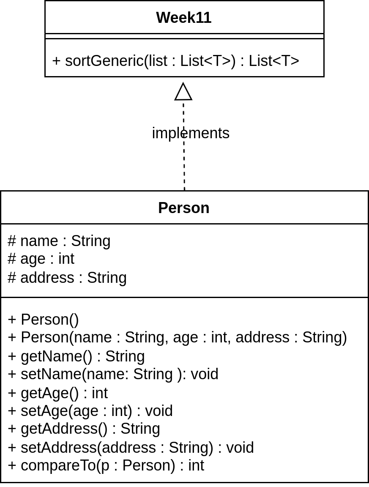

### Đề bài :

Một ví dụ đơn giản để có thể giúp ta dễ tiếp cận lập trình tổng quát trong Java. Sử dụng lập trình tổng quát trong Java, ta có thể viết một phương thức chung để xếp thứ tự mảng của đối tượng, sau đó gọi phương thức generic này với các mảng integer, các mảng double, các mảng String,… để xếp thứ tự các phần tử của mảng.

- **Phương thức tổng quát – Generic method**

Ta có thể viết một khai báo phương thức tổng quát mà có thể được gọi với các tham số của các kiểu khác nhau. Dựa trên các kiểu tham số được truyền tới phương thức tổng quát này, bộ biên dịch xử lý mỗi lần gọi phương thức một cách thích hợp. Khi khai báo phương thức tổng quát, luôn cần kèm theo 1 đoạn tham số kiểu được giới hạn bởi các dấu ngoặc nhọn (< và >) mà đứng trước kiểu trả về của phương thức (&lt;T&gt; trong ví dụ dưới đây).

Ví dụ dưới đây minh họa cách ta có thể in mảng các kiểu khác nhau bởi sử dụng một phương thức tổng quát:

```java
public class GenericMethodTest {
    public static <T> void printArr(T[] inputArray) {
        for ( T element : inputArray ) {
            System.out.printf( "%s ", element );
        }
    }

    public static void main( String args[] ) {
        Integer[] intArr = { 10, 12, 3, -4, 5 };
        Double[] doubleArr = { 5.1, 2.5, 7.3, -4.5 };
        Character[] charArr = { 'U', 'E', 'T', 'V', 'N', 'U' };

        System.out.println("Mang intArr bao gom:");
        printArr(intArr);

        System.out.println("\nMang doubleArr bao gom:");
        printArr(doubleArr);

        System.out.println("\nMang charArr bao gom:");
        printArr(charArr); 
    }
}
```

Kết quả in ra như sau:

```
Mang intArr bao gom:
10 12 3 -4 5
Mang doubleArr bao gom:
5.1 2.5 7.3 -4.5
Mang charArr bao gom:
U E T V N U
```

- **Lớp tổng quát – Generic class**

Việc khai báo lớp tổng quát giống như khai báo 1 lớp bình thường, ngoại trừ tên lớp được theo sau bởi một đoạn tham số kiểu. Giống như với phương thức tổng quát, đoạn tham số kiểu của một lớp tổng quát có thể có một hoặc nhiều tham số kiểu, chúng phân biệt nhau bởi dấu phẩy. Ví dụ dưới đây minh họa cách ta định nghĩa một lớp tổng quát trong Java:

```java
public class Box<T> {
    private T t;
    public void add(T t) {
        this.t = t;
    }
    public T get() {
        return t;
    }

    public static void main(String[] args) {
        Box<Integer> integerBox = new Box<Integer>();
        Box<String> stringBox = new Box<String>();

        integerBox.add(new Integer(10));
        stringBox.add(new String("Hello World"));

        System.out.printf("Gia tri integer la: %d\n", integerBox.get());
        System.out.printf("Gia tri string la: %s", stringBox.get());
    }
}
```

Kết quả in ra:

```
Gia tri integer la: 10  
Gia tri string la: Hello World
```
Yêu cầu: Áp dụng lập trình tổng quát, hãy:

a. Hãy tạo lớp **Week11** chứa phương thức sortGeneric (như mô tả hình bên dưới) để sắp xếp một mảng chứa các phần tử T (với T có thể là **Integer** hoặc **String**). _Chú ý: Tự cài đặt thuật toán sắp xếp._

Mô tả phương thức như bảng sau:



b. Tạo lớp **Person** ([POJO](https://en.wikipedia.org/wiki/Plain_old_Java_object)) gồm các thuộc tính: **name**: String (tên), **age**: int (tuổi), **address**: String (địa chỉ). Hãy cài đặt lớp **Person** thích hợp để có thể sắp xếp được bằng phương thức sortGeneric đã tạo ở trên. Các đối tượng Person được “sắp xếp” dựa theo việc sắp xếp _tên_, nếu _tên_ giống nhau thì dựa trên sắp xếp _tuổi_.

Ví dụ: Có 3 đối tượng Person

```
1.Person1 (name=”Nguyen A”, age=22, address=…)
2.Person2 (name=”Nguyen A”, age=20, address=…)
3.Person3 (name=”Le B”, age=20, address=…)
```

Thì thứ tự sắp xếp là: Person3 < Person2 < Person1

### Định dạng đầu vào :

1. Các file .java nộp lên **không định danh package** trong đó (bỏ tất cả dòng pakage)
2. Tất cả **file .java** đặt **cùng trong một folder** và được nén lại dưới đuôi .zip
3. **Tên folder** chứa các **file .java** không được chứa ký tự đặc biệt hoặc ký tự khoảng trắng.

### Source code mẫu :

None

### Điều kiện :

None