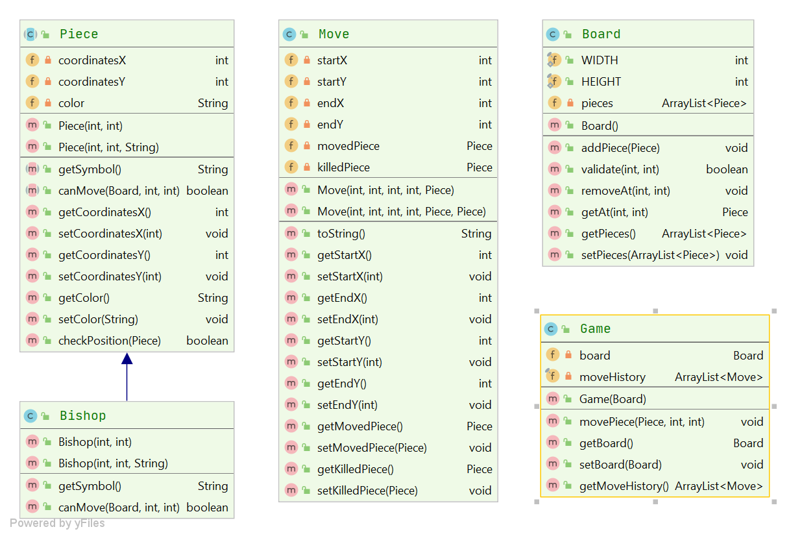
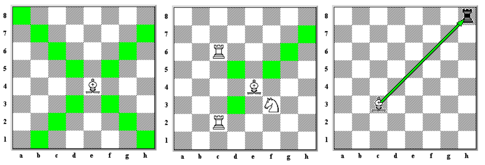

### Đề bài :

## 1. Tổng quan

**Mục tiêu bài tập:** thiết kế các lớp Java để mô phỏng các thao tác trong trò chơi Cờ vua

**Phạm vi:** chỉ bao gồm các lớp mô tả thao tác xử lý logic, không bao gồm lớp thiết kế giao diện. Sinh viên cần cài đặt các phương thức đúng với logic có trong game **Cờ vua**.

**Mô tả tóm tắt trò chơi Cờ vua:** Trò chơi cờ vua diễn ra trên một bảng hình vuông, gọi là bàn cờ, gồm 8 hàng (đánh số từ 1 đến 8) và 8 cột (đánh các chữ cái từ a đến h), tạo ra 64 ô hình vuông với các màu đậm và nhạt xen kẽ nhau, với mỗi người chơi sẽ có ô màu nhạt ở hàng cuối cùng bên tay phải của mình khi ngồi vào bàn chơi cờ. Mỗi người sẽ bắt đầu ván cờ với 16 quân cờ và sẽ lần lượt đi các quân của mình sau khi đối phương đã đi xong một nước (hoàn thành nước đi). Các quân cờ của mỗi bên bao gồm 8 tốt, 2 mã, 2 tượng, 2 xe, 1 hậu và 1 vua.

Các quân cờ có nước đi khác nhau:

- **Xe** (ký hiệu quốc tế **R** - Rook): di chuyển theo các đường thẳng dọc theo cột hay hàng tới ô còn trống mà không có quân nào cản trên đường đi hay tới ô bị quân đối phương chiếm giữ (ăn quân) nhưng không thể vượt qua quân đang đứng ở ô đó.
- **Tượng** (ký hiệu quốc tế **B** - Bishop): di chuyển theo đường chéo tới ô có cùng màu với nguyên lý tương tự như xe, tới ô còn trống hay ô bị quân đối phương chiếm giữ (ăn quân).
- **Hậu** (ký hiệu quốc tế **Q** - Queen) có nước đi là tổ hợp đơn giản của chuyển động của xe và tượng. Trong một nước đi nó có thể di chuyển theo đường chéo hoặc đường thẳng dọc theo cột hay hàng, với nguyên lý đi và ăn quân giống như tượng và xe.
- **Mã** (ký hiệu quốc tế **N** - Knight)) có thể di chuyển tới ô còn trống hay ô bị quân đối phương chiếm giữ (ăn quân) theo dạng hình chữ L (hình chữ nhật 3×2 hay 2×3). Quân mã không bị cản như trong cờ tướng.
- **Tốt** (không cần ký hiệu) có thể di chuyển thẳng về phía trước chỉ một ô một lần tới ô còn trống (đi mà không ăn quân) hoặc hai ô khi bắt đầu di chuyển từ vị trí khởi tạo, nhưng khi di chuyển quân để ăn quân đối phương thì đi chéo 1 bước.
- **Vua** (ký hiệu quốc tế là **K** - King) là quân quan trọng nhất, nếu mất vua thì người chơi thua cuộc. Mỗi lần đi nó có thể ăn quân hoặc di chuyển sang các ô bao quanh nó.

## 2. Biểu đồ thiết kế lớp _(Phiên bản đơn giản, chưa đầy đủ)_

Hình vẽ sau mô tả thiết kế lớp cơ bản để mô phỏng đối tượng trong trò chơi Cờ vua. Thiết kế này chưa bao gồm đầy đủ tất cả các quân cờ có trong trò chơi. **Đối với các lớp đại diện cho loại quân cờ, phạm vi bài tập chỉ yêu cầu sinh viên cài đặt lớp Java cho quân Tượng - Bishop.**

### _Sinh viên hãy xây dựng các lớp Java theo thiết kế này và cài đặt nội dung các phương thức sao cho phù hợp với luật chơi Cờ vua._

## 3. Mô tả chi tiết các lớp

### `Piece`: là lớp trừu tượng đại diện cho các quân cờ.

- Bao gồm các thuộc tính `private` với ý nghĩa như sau:
    - `coordinatesX, coordinatesY`: tọa độ của quân cờ trong bàn cờ, kiểu `int` thỏa mãn 1 <= coordinatesX, coordinatesY <= 8
    - `color`: màu của quân cờ, kiểu `string`, chỉ có thể mang giá trị là `“black”` hoặc `“white”`

- Bao gồm các phương thức `public` có chức năng như sau:
    - Phương thức khởi tạo gồm 2 tham số `x, y` khởi tạo tọa độ cho quân cờ, thuộc tính color có giá trị mặc định là `“white”`
    - Phương thức khởi tạo gồm 3 tham số `x, y, color` khởi tạo giá trị cho 3 thuộc tính tương ứng
    - Getter/setter cho thuộc tính private
    - Phương thức trừu tượng getSymbol() trả về dữ liệu kiểu String là ký hiệu quốc tế của mỗi loại quân cờ
    - Phương thức trừu tượng canMove(Board board, int x, int y) trả về kiểu dữ liệu boolean để kiểm tra xem quân cờ có thể đi đến vị trí x, y trên bàn cờ board hay không. Mỗi loại quân cờ có cách đi khác nhau nên các phép xử lý logic trong phương thức này là khác nhau.

### `Board`: là lớp đại diện cho bàn cờ.

- Khai báo 2 hằng số WIDTH = 8, HEIGHT = 8 tương ứng với số cột và số hàng của bàn cờ.

- Bao gồm các thuộc tính `private` với ý nghĩa như sau:
    - `pieces`: danh sách các quân cờ hiện tại có trong bàn cờ, kiểu `ArrayList<Piece>`

- Bao gồm các phương thức `public` có chức năng như sau:
    - Phương thức `validate(int x, int y): boolean`, sử dụng để kiểm tra tọa độ `x, y` có thỏa mãn 1 <= `x, y` <=8 hay không
    - Phương thức `addPiece(Piece piece):void`, chức năng thêm một quân cờ vào trong bàn cờ bằng cách thêm phần tử mới vào thuộc tính `pieces` của lớp. Quân cờ `piece` chỉ được thêm vào mảng `pieces` khi có tọa độ hợp lệ và tọa độ của nó không trùng với quân cờ nào đã có trong danh sách
    - Phương thức `getAt(int x, int y):Piece` trả về quân cờ đang ở vị trí `x, y` trên bàn cờ. Nếu không có, trả về `null`
    - Phương thức `removeAt(int x, int y):void` thực hiện chức năng xóa quân cờ tại vị trí `x, y` ra khỏi bàn cờ
    - Getter/setter cho thuộc tính `private`

### `Move`: là lớp đại diện cho nước đi của người chơi.

- Bao gồm các thuộc tính `private` với ý nghĩa như sau:
    - `movedPiece`: kiểu `Piece`, lưu trữ quân cờ di chuyển
    - `startX, endX, startY, endY`: kiểu dữ liệu `int`, tương ứng là tọa độ bắt đầu và tọa độ đến của nước đi
    - `killedPiece`: kiểu `Piece`, lưu trữ quần cờ bị hạ nếu có

- Bao gồm các phương thức `public` có chức năng như sau: _Phương thức khởi tạo 5 tham số `public Move(int startX, int endX, int startY, int endY, Piece movedPiece)` khởi tạo giá trị tương ứng cho các thuộc tính_. Phương thức khởi tạo 6 tham số `public Move(int startX, int endX, int startY, int endY, Piece movedPiece, Piece killedPiece)` khởi tạo giá trị tương ứng cho các thuộc tính. * Phương thức `toString():String`: trả về thông tin đại diện cho object Move, có format như sau: Màu-ký kiệu quốc tê + tọa độ di chuyển theo chuẩn [Algebraic notation](https://en.wikipedia.org/wiki/Algebraic_notation_(chess)#:~:text=Algebraic%20notation%20(or%20AN)%20is,books%2C%20magazines%2C%20and%20newspapers).

        * Ví dụ `white-Ra7` : Quân cờ **Xe** trắng di chuyển tới vị trí cột a hàng 7 tương ứng với `(x=1, y=7)`

  * Getter/setter cho thuộc tính `private`

### `Bishop`: là lớp đại diện cho quân cờ Tượng.

- Kế thừa lớp cha `Piece`.
- Bao gồm các phương thức `public` có chức năng như sau:
    - Phương thức `getSymbol():string` kế thừa từ lớp cha trả về chuỗi `“B”` - ký hiệu quốc tế của quân **Tượng**
    - Phương thức `canMove(Board board, int x, int y):boolean` chức năng là kiểm tra xem quân xe có di chuyển đến được vị trí `x, y` trong bàn cờ hay không, trả về `true` nếu có, ngược lại là `false`. Tượng chỉ được đi chéo, trên đường đi nếu gặp chướng ngại vật (quân cờ khác) thì không được di chuyển, nếu tại vị trí `x, y` có quân cờ khác màu (ăn quân) thì coi là có thể di chuyển. 

### `Game`: là lớp quản lý trò chơi.

- Bao gồm các thuộc tính `private` với ý nghĩa như sau:
    - `board`: kiểu `Board` lưu trạng thái của bàn cờ hiện tại
    - `moveHistory`: kiểu `ArrayList<Move>` lưu lịch sử các nước đi theo thứ tự thời gian.
Bao gồm các phương thức `public` có chức năng như sau:
    - Phương thức `movePiece(Piece piece, int x, int y): void` di chuyển quân cờ `piece` đến vị trí `x, y` nếu hợp lệ. Nếu di chuyển được, tạo đối tượng `Move` và thêm vào mảng `moveHistory`. Làm tương tự với trường hợp nước đi hạ một quân cờ khác, đồng thời thực hiện xóa quân cờ đó khỏi bàn cờ `board`
    - Phương thức khởi tạo một tham số kiểu `Board` để khởi tạo giá trị cho thuộc tính `board`
    - Getter/setter cho thuộc tính `board`
    - Getter cho thuộc tính `moveHistory`

### _Lưu ý: Mã nguồn khi nộp tuân thủ định dạng như sau:_

- Các file .java nộp lên không định danh package trong đó (bỏ tất cả dòng pakage)
- Tất cả file .java đặt cùng trong một folder và được nén lại dưới đuôi .zip
- Tên folder chứa các file .java không được chứa ký tự đặc biệt hoặc ký tự khoảng trắng.

### _~Hết~_