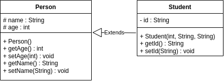
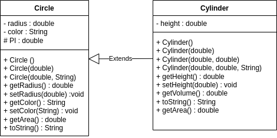

### Đề bài :

Biểu đồ lớp (class diagram) dưới đây thể hiện mối quan hệ kế thừa giữa 2 lớp, trong đó lớp Student (sub-class) kế thừa lớp Person (super-class). Biểu đồ được xây dựng theo chuẩn UML2: https://en.wikipedia.org/wiki/Class_diagram. Trong biểu đồ này:

- Lớp Person có:
    - Thuộc tính `name`, mức truy nhập `protected` (dấu #), kiểu `String`
    - Thuộc tính `age`, mức truy nhập `protected` (dấu #), kiểu `int`
    - Phương thức khởi tạo không tham số `Person()`, mức truy nhập `public` (dấu +)
    - Phương thức khởi tạo 2 tham số `public Person(int age, String name)`
    - Các phương thức `public getter/setter` cho 2 thuộc tính `name` và `age`

- Lớp `Student` kế thừa lớp `Person`, có:
    - Thuộc tính `id`, mức truy nhập `private`, kiểu `String` https://raw.githubusercontent.com/oasis-uet/uetoop/main/Kethua1.png
    - Phương thức khởi tạo 3 tham số p`ublic Person(int age, String name, String id)`
    - Các phương thức `public getter/setter` cho thuộc tính `id`



Khi cài đặt code cho biểu đồ lớp bên trên, mã nguồn tương ứng như sau:

```java
//file Person.java
public class Person {
    protected int age;
    protected String name;
    
    public Person() {
    }
    
    public Person(int age, String name) {
        this.age = age;
        this.name = name;
    }
    
    public int getAge() {
        return age;
    }
    
    public void setAge(int age) {
        this.age = age;
    }
    
    public String getName() {
        return name;
    }
    
    public void setName(String name) {
        this.name = name;
    }
}

//file Student.java
public class Student extends Person {
    private String id; //MSSV
    
    public Student(int age, String name, String id) {
        super(age, name);
        this.id = id;
    }
    
    public String getId() {
        return id;
    }
    
    public void setId(String id) {
        this.id = id;
    }
}
```

**Yêu cầu:** Dựa vào hướng dẫn bên trên, hãy hoàn thành yêu cầu dưới đây.

Cài đặt 2 lớp **Circle** và **Cylinder** tuân theo biểu đồ lớp dưới đây:



Sau khi cài đặt xong, thực hiện tiếp các yêu cầu dưới đây:

1. Sử dụng **static final** khai báo hằng số, có tên là **PI**, kiểu dữ liệu **double**, mức truy cập **protected** để các phương của lớp **Cylinder** có thể sử dụng được. Các phương thức tính diện tích, thể tích sử dụng giá trị của hằng số **PI** này để tính toán.

2. Override phương thức **toString()** cho lớp **Cylinder**, trả về giá trị theo định dạng  
Cylinder[Circle[radius=r,color=c],height=h]

_Gợi ý tái sử dụng phương thức **toString()** của lớp **Circle** thông qua từ khóa **super** để xây dựng phương thức **toString()** này_

3. Override phương thức **getArea()** cho lớp **Cylinder**

_Gợi ý sử dụng phương thức **getArea()** của lớp **Circle** để tính diện tích cho hai mặt đáy_

### Định dạng đầu vào :

1. Các file .java nộp lên **không định danh package** trong đó (bỏ tất cả dòng pakage)
2. Tất cả **file .java** đặt **cùng trong một folder** và được nén lại dưới đuôi .zip
3. **Tên folder** chứa các **file .java** không được chứa ký tự đặc biệt hoặc ký tự khoảng trắng.

### Source code mẫu :

None