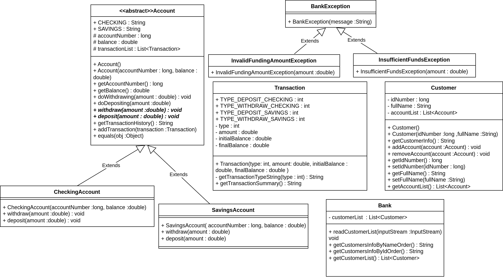

### Đề bài :

## Tổng quan

Các bạn sẽ thực hiện cài đặt một hệ thống ngân hàng phiên bản đơn giản.

Thiết kế của hệ thống bao gồm một đại diện cho ngân hàng. Một ngân hàng có thể có nhiều khách hàng. Một khác hàng có thể có nhiều tài khoản. Có hai loại tài khoản là tài khoản vãng lai (checking account) và tài khoản tiết kiệm (savings account). Tài khoản tiết kiệm thì chỉ rút ra được tối đa `$1000` mỗi lần và số dư tài khoản phải có ít nhất `$5000`. Một tài khoản có thể có nhiều giao dịch, phân làm hai loại chính là nạp và rút tiền vào tài khoản đó.

Hệ thống này cho phép thực hiện các chức năng như sau:

1. Đọc dữ liệu khách hàng từ một CSDL cho trước (dữ liệu text có định dạng)

2. Thêm tài khoản và xóa tài khoản của khách hàng

3. Thực hiện giao dịch nạp và rút tiền

4. In thông tin lịch sử giao dịch của các tài khoản

5. In thông tin khách hàng theo thứ tự số CMND hoặc họ tên

## Biểu đồ lớp

Dưới đây là biểu đồ lớp cho toàn bộ hệ thống, có đầy đủ thông tin thiết kế các lớp, các thuộc tính và phương thức mà các bạn cần cài đặt tuân theo.



## Mô tả chi tiết từng lớp và chức năng cần thực hiện

Các bạn đọc kỹ mô tả chi tiết về các Lớp và chức năng dưới đây và thực hiện cài đặt:

1. Lớp `Bank`: Đại diện cho phía ngân hàng
    - Thuộc tính `customerList`, là danh sách khách hàng của ngân hàng đó
    - Phương thức `readCustomerList`, nhận đầu vào là một `InputStream`, nhiệm vụ là đọc và tải thông tin cá nhân, thông tin tài khoản của khách hàng vào hệ thống. Dữ liệu trong `InputStream` là dữ liệu text và có định dạng như ví dụ dưới dây. Trong đó mỗi dữ liệu của khách hàng bao gồm: dòng đầu tiên gồm tên và số CMND (9 chữ số) khách hàng; các dòng tiếp theo chứa thông tin các tài khoản, mỗi tài khoản gồm 3 thông tin (số tài khoản (10 chữ số), loại tài khoản, số dư) ngăn cách bởi một ký tự trắng. Dữ liệu của các khách hàng được lưu trữ liên tiếp nhau trên các dòng ký tự.
   
        ```
        Nguyễn Thị A 123456789
        1234567890 CHECKING 1000.0
        1234567891 SAVINGS 3000.0
        Lê Hoàng B 123456788
        1234567892 CHECKING 5000.0
        Hoàng Văn C 123456787
        ```
     
    - Phương thức `getCustomersInfoByIdOrder` trả về dữ liệu danh sách khách hàng sắp xếp tăng dần theo số CMND, có định dạng như ví dụ dưới đây
   
        ```
        Số CMND: 123456787. Họ tên: Hoàng Văn C.
        Số CMND: 123456788. Họ tên: Lê Hoàng B.
        Số CMND: 123456789. Họ tên: Nguyễn Thị A.
        ```

    - Phương thức `getCustomersInfoByNameOrder` có chức năng tương tự `getCustomersInfoByIdOrder`, nhưng là sắp xếp tăng dần theo họ tên khách hàng

2. Lớp `Customer`: Đại diện cho một khách hàng
    - Thuộc tính `accountList`, là danh sách tài khoản của khách hàng đó
    - Thuộc tính `idNumber` là số CMND và thuộc tính `fullName` là họ tên
    - Phương thức `getCustomerInfo`, trả về thông tin khách hàng biểu diễn ở định dạng text, phục vụ cho các phương thức `getCustomersInfoByNameOrder` và `getCustomersInfoByIdOrder` của lớp `Bank`
    - Các phương thức `addAccount` và `removeAccount`, thêm và xóa tài khoản cho danh sách `accountList`

3. Lớp `Account`: Đại diện cho một tài khoản, lớp này là trừu tượng
    - Thuộc tính `accountNumber` là số tài khoản, balance là số dư
    - Thuộc tính `transactionList`, là danh sách các giao dịch đã được thực hiện
    - Các hằng số `CHECKING`, `SAVINGS` là `public static final`, có giá trị lần lượt là "CHECKING", "SAVINGS", phục vụ cho việc đọc dữ liệu khách ở phương thức `readCustomerList` tại lớp `Bank`
    - Các phương thức `deposit`, `withdraw` thực hiện nạp và rút tiền, đều là trừu tượng và được cài đặt ở các lớp con.
    - Phương thức `doDepositing`, sẽ được gọi bởi `deposit`, thực hiện kiểm tra tính hợp lệ của giao dịch nạp tiền (ví dụ: số tiền nạp vào âm). Nếu số tiền nạp không hợp lệ, ném ra ngoại lệ phù hợp. Ngược lại, cộng số tiền nạp vào số dư tài khoản `balance`.
    - Phương thức `doWithdrawing`, sẽ được gọi bởi `withdraw`, thực hiện kiểm tra tính hợp lệ của giao dịch rút tiền (ví dụ: số tiền rút ra âm, số dư không đủ). Nếu số tiền rút không hợp lệ, ném ra ngoại lệ phù hợp. Ngược lại, trừ đi số dư tài khoản `balance` một lượng bằng số tiền rút ra.
    - Phương thức `addTransaction`, thêm một giao dịch mới vào danh sách `transactionList`
    - Phương thức `getTransactionHistory`, trả về lịch sử giao dịch của một tài khoản. Dữ liệu trả về có định dạng như ví dụ dưới đây. Thứ tự giao dịch in ra theo thứ tự lưu trong danh sách `transactionList`.
   
        ```
        Lịch sử giao dịch của tài khoản 1234567890:
        - Kiểu giao dịch: Nạp tiền vãng lai. Số dư ban đầu: $1000.00. Số tiền: $500.00. Số dư cuối: $1500.00.
        - Kiểu giao dịch: Rút tiền vãng lai. Số dư ban đầu: $1000.00. Số tiền: $1200.00. Số dư cuối: $300.00.
        ```

    - Phương thức `equals`, kiểm tra hai toàn khoản giống nhau hay không dựa trên số tài khoản, phục vụ cho việc thêm và xóa tài khoản của khách hàng

4. Lớp `CheckingAccount`: Đại diện cho một tài khoản vãng lai. Kế thừa lớp `Account`.
    - Cài đặt phương thức `deposit` từ `Account`. Gọi đến `doDepositing` để nạp tiền. Nếu có ngoại lệ xảy ra thì xử lý và in ra thông báo lỗi lên màn hình (`System.out`).
    - Cài đặt phương thức `withdraw` từ `Account` bằng cách gọi đến `doWithdraw`. Xử lý ngoại lệ nếu xảy ra tương tự như ở `deposit`. 

5. Lớp `SavingsAccount`: Đại diện cho một tài khoản tiết kiệm. Cài đặt tương tự như ở tài khoản vãng lai, tuy nhiên chú ý cần kiểm tra điều kiện đặc biệt đối với loại tài khoản này: số dư tối thiểu và số tiền tối đa khi thực hiện rút tiền.

6. Lớp `Transaction`: Đại diện cho một giao dịch.
    - Các thuộc tính `amount` là số tiền giao dịch, `initialBalance` và `finalBalance` là số dư tài khoản trước và sau khi thực hiện giao dịch
    - Thuộc tính `type` là kiểu giao dịch. Có các kiểu "Nạp tiền vãng lai", "Rút tiền vãng lai", "Nạp tiền tiết kiệm", "Rút tiền tiết kiệm".
    - Các hằng số `TYPE_DEPOSIT_CHECKING`, `TYPE_WITHDRAW_CHECKING`, `TYPE_DEPOSIT_SAVINGS`, `TYPE_WITHDRAW_SAVINGS` phục vụ lưu trữ cho các kiểu giao dịch, là `public static final`, giá trị là số nguyên tùy chọn
    - Phương thức `getTransactionTypeString`, nhận vào là kiểu giao dịch định dạng số nguyên, trả về tên kiểu giao dịch. Ví dụ: `TYPE_DEPOSIT_CHECKING` -> "Nạp tiền vãng lai". Phương thức này phục vụ cho phương thức `getTransactionSummary`.
    - Phương thức `getTransactionSummary`, trả về thông tin giao dịch với định dạng như ví dụ: `- Kiểu giao dịch: Nạp tiền vãng lai. Số dư ban đầu: $1000.00. Số tiền: $500.00. Số dư cuối: $1500.00.`. Phương thức này phục vụ cho `getTransactionHistory` của lớp `Account`.
    - Phương thức khởi tạo có tham số lần lượt là kiểu giao dịch, số tiền giao dịch, số dư ban đầu, số dư sau khi thực hiện giao dịch

7. `Lớp BankException`: Đại diện cho ngoại lệ có thể xảy ra trong hệ thống, thừa kế `java.lang.Exception`

8. Lớp `InvalidFundingAmountException`: Đại diện cho ngoại lệ xảy ra khi số tiền được giao dịch không hợp lệ (ví dụ: số âm). Thông điệp ngoại lệ có định dạng như ví dụ: `Số tiền không hợp lệ: $-100.00`, trong đó `$-100.00` là số tiền giao dịch và giá trị này được truyền vào nhờ phương thức khởi tạo có tham số. Lớp này thừa kế `BankException`.

9. Lớp `InsufficientFundsException`: Đại diện cho ngoại lệ xảy ra khi số tiền được giao dịch vượt quá số dư. Thông điệp ngoại lệ có định dạng như ví dụ: `Số dư tài khoản không đủ $9999.00 để thực hiện giao dịch`, trong đó `$9999.00` là số tiền giao dịch và giá trị này được truyền vào nhờ phương thức khởi tạo có tham số. Tương tự `InvalidFundingAmountException`, lớp này cũng thừa kế `BankException`.