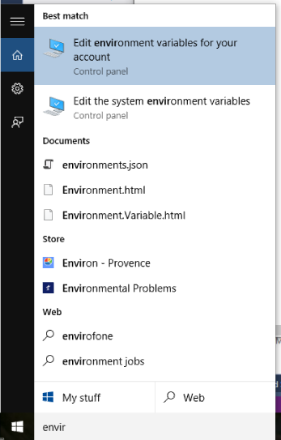
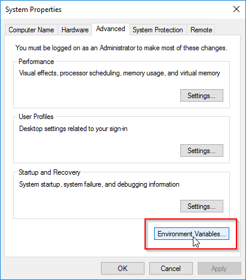
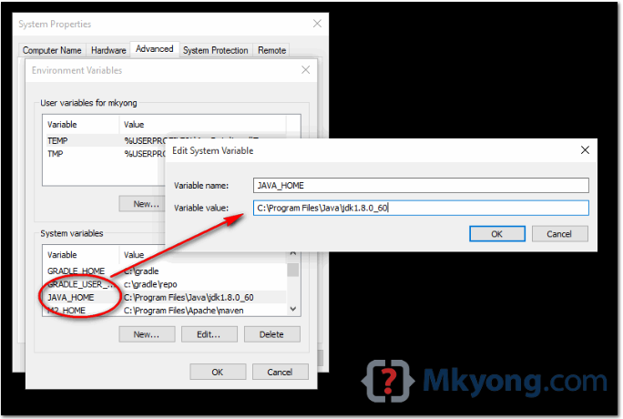
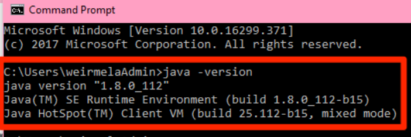

### Đề bài :

**Triển khai trên máy tính cá nhân:**

1. Tải và cài đặt Oracle JDK8 tại [đây](https://www.oracle.com/technetwork/java/javase/downloads/jdk8-downloads-2133151.html). Lưu ý, ở đây sử dụng Oracle JDK (ngoài ra có thể tìm hiểu thêm OpenJDK), Java SE, phiên bản 1.8 (đã có nhiều JDK version mới hơn, tuy nhiên để thống nhất sẽ chọn JDK8).

2. Làm quen dòng lệnh trên Windows (trên Linux tương tự, chỉ 1 vài khác biệt nhỏ), các lệnh cơ bản (cd, dir/ls, copy/cp, etc):

   - Mở cmd bằng cách tìm kiếm “cmd”, hoặc dùng **Windows + R** -> gõ “cmd” -> Enter

   - Lệnh cd (change directory): câu lệnh này dùng để thay đổi vị trí thư mục hiện tại – di chuyển đến vị trí thư mục khác. Một số cách khác nhau khi sử dụng lệnh cd là:
     * `cd .`: đứng nguyên ở thư mục hiện tại
     * `cd ..`: di chuyển đến thư mục cha của thư mục hiện tại
     * `cd /`: di chuyển đến thư mục gốc của ố đĩa hiện tại (ví dụ: C:\ hoặc D:\,…)
     * `cd <tên thư mục con>`: di chuyển đến thư mục con bên trong thư mục hiện tại
     * `cd <đường dẫn đến thư mục>`: di chuyển đến thư mục với đường dẫn là đường dẫn cho trước.

   - Lệnh dir (directory), (trên Linux tương ứng là ls): Hiển thị danh sách các tập tin và thư mục trong thư mục hiện tại.

3. Thêm Java vào biến môi trường Path, test thử lệnh `java`, `javac`

    - Sử dụng Windows search (`Windows + S`) tìm kiếm “Edit the system environment variable”. Trong hộp thoại “System Properties” hiện lên, chọn “Environment Variables” như hình.

    

    Trong hộp thoại Environment Variables, vào phần System variables và chọn New.

    

    Trong hộp thoại New System Variable, điền vào ô **Variable name** là **JAVA_HOME**, còn trong ô **Variable value** nhấn vào nút **Browse Directory** và trỏ tới đường dẫn cài đặt JDK. Nhấn OK để hoàn tất việc đặt tên biến môi trường.
 
    

    Tiếp theo, cũng trong phần System variables, tiến hành sửa đổi biến môi trường **Path** như sau: Kích chuột vào dòng **Path** và chọn **Edit**. Hộp thoại **Edit environment variable** xuất hiện, chúng ta nhấn chuột vào nút **New** và điền vào dòng sau: **%JAVA_HOME%\bin**, nhấn OK để kết thúc.

    

    - Kiểm tra bằng cách mở cmd, nhập vào dòng: **java –version**. Nếu thông tin hiển thị ra là version Java tương tự như hình dưới là thành công.

4. Sau khi đã hoàn tất việc cài đặt Java, hãy viết chương trình đơn giản in ra dòng “Hello World”, biên dịch và thực thi sử dụng command. Giả sử code được lưu trong file Week1.java, gợi ý các bước làm như sau:

   - Sử dụng lệnh `cd` để đến thư mục chứa file Week1.java.

   - Thực thi command `javac Week1.java` để biên dịch mã nguồn, nếu không có lỗi in ra là thành công.

   - Thực thi command `java Week1`, nếu thành công sẽ in ra dòng chữ “Hello World”.

5. Thêm tham số dòng lệnh, in ra **Hello student_name**, trong đó _student_name_ là tên được truyền vào bằng tham số dòng lệnh.

Sau khi triển khai trên máy tính cá nhân, bạn hãy viết một chương trình bao gồm lớp `Solution` có phương thức `printHello()` trả về kết quả `HelloWorld`, trong hàm `main` của lớp này gọi đến phương thức `printHello()` và in ra màn hình kết quả `HelloWorld`. Viết nội dung tệp Solution.java vào phần dưới đây:

Chú ý: Không được thay đổi tên lớp Solution