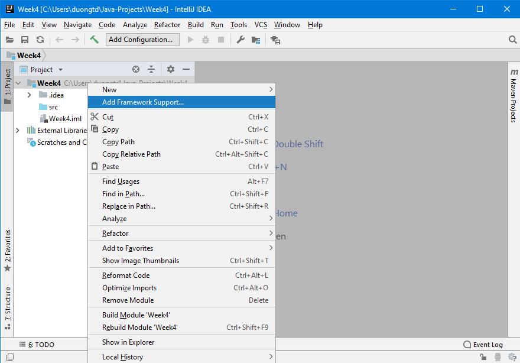
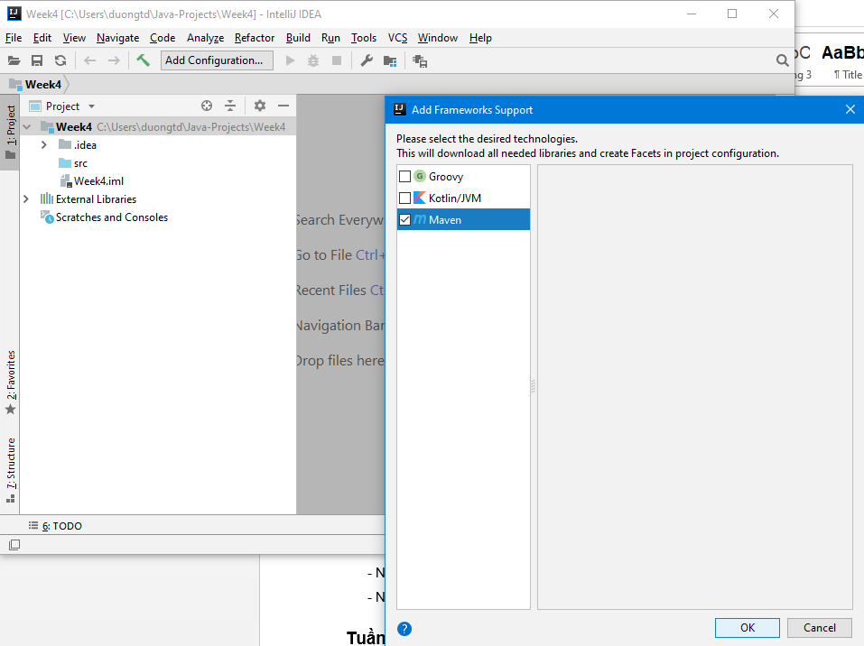
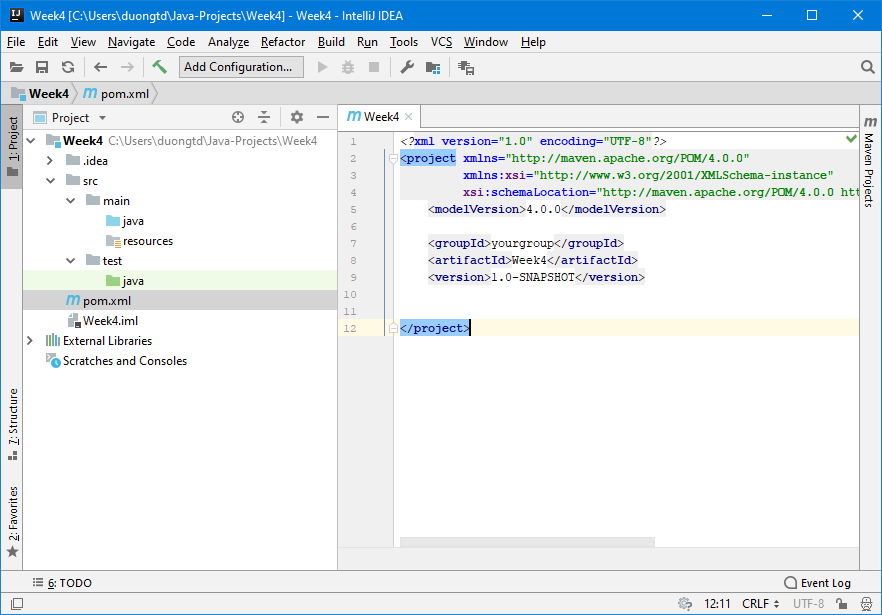
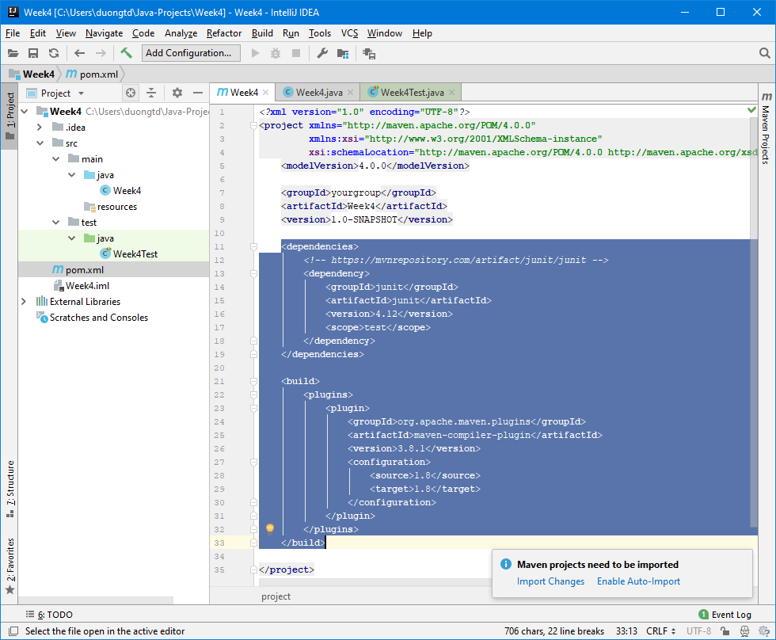

### Đề bài :

Viết các phương thức static sau, sử dụng JUnit viết từng phương thức ít nhất 5 bộ test để kiểm tra tính đúng đắn (sử dụng phương thức assertEquals). 
Sử dụng code mẫu tại: https://github.com/oasis-homework/Week4

a. Tìm giá trị lớn nhất của hai số nguyên, giá trị trả về của phương thức là số lớn nhất (phương thức `max2Int`)

b. Tìm giá trị nhỏ nhất của của một mảng số nguyên (kích thước mảng <= 100 phần tử) (phương thức `minArray`)

c. Viết chương trình tính chỉ số BMI theo công thức sau: (phương thức calculateBMI)

BMI = Cân nặng (kg) / ( Chiều cao(m) ^ 2) (Làm tròn kết quả tính được đến chữ số thập phân thứ nhất)  
In ra kết quả đánh giá chỉ số BMI dựa theo công thức trên:

- Nếu BMI dưới 18.5 thì trả về “Thiếu cân”
- Nếu BMI từ 18.5 đến 22.9 thì trả về “Bình thường”
- Nếu BMI từ 23 đến 24.9 thì trả về “Thừa cân“
- Nếu BMI >= 25 thì trả về “Béo phì”

Hướng dẫn:

Có nhiều cách khác nhau để thêm thư viện JUnit vào project, để từ đó có thể sử dụng JUnit viết các test case. 
Hướng dẫn này giới thiệu cách sử dụng Maven để thêm thư viện JUnit vào project.

Đầu tiên giới thiệu qua về Maven, đây là một chương trình quản lý project cho phép developers có thể quản lý về version, các dependencies (các thư viện sử dụng trong dự án), quản lý build, tự động download javadoc & source,… 
bạn hoàn toàn có thể download thủ công các thư viện (.jar), ví dụ như JUnit, sau đó thêm thủ công vào project. 
Tuy nhiên, khi số lượng các thư viện dependencies lớn, công việc import thủ công là rất vất vả, chưa kể đến việc version của các thư viện có thể conflict với nhau. 
Maven có thể giải quyết vấn đề này.

Để sử dụng Maven trong IntelliJ, có 2 cách. 
Cách 1, trong quá trình tạo mới project (_File -> New -> Project_), bạn chọn đúng kiểu project là Maven trong cửa sổ hiện ra. 
Cách 2, từ một project Java thông thường như các tuần trước, IntelliJ cho phép bạn convert sang Maven project bằng cách _right click project -> Add Framework Support_



Sau đó, trong cửa sổ hiện ra tích chọn Maven, và click OK để xác nhận.



Sau khi hoàn tất, project đã được chuyển sang Maven project, trong đó có chứa file pom.xml – đây là file khai báo các cấu hình (config) cho project của bạn, trong đó có chứa các thư viện sẽ sử dụng (dependencies)



Tiếp theo, để thêm thư viện JUnit 4.2, các bạn chép đoạn mã sau đặt vào trong thẻ <dependencies> </dependencies> (lưu ý, nếu chưa có thẻ này thì tự tạo thêm thẻ dependencies nằm trong thẻ project).

```xml
<dependency>
    <groupId>junit</groupId>
    <artifactId>junit</artifactId>
    <version>4.12</version>
    <scope>test</scope>
</dependency>
```

Thêm nữa, bạn cần thêm đoạn mã config Maven Compiler Plugin như dưới (đặt trong thẻ project).

```xml
<build>
    <plugins>
      <plugin>
        <groupId>org.apache.maven.plugins</groupId>
        <artifactId>maven-compiler-plugin</artifactId>
        <version>3.8.1</version>
        <configuration>
          <source>1.8</source>
          <target>1.8</target>
        </configuration>
      </plugin>
    </plugins>
</build>
```

Cuối cùng, click vào Import Changes được hiện ra ở cuối sau khi bạn chỉnh sửa file pom.xml, thư viện JUnit sẽ được them vào project. Hoặc cách khác _right click project -> Maven -> Reimport_.



Chú ý: Ở các phiên bản Maven cũ, khi các bạn thực hiện theo hướng dẫn sẽ báo lỗi `501 HTTPS Required` do Maven Central đã bắt buộc client sử dụng giao thức https để giao tiếp. 
Nếu các bạn gặp lỗi này, hãy thêm những dòng dưới đây vào tệp `pom.xml` ở trong thẻ `<project></project>`.

```xml
<pluginRepositories>
  <pluginRepository>
    <id>central</id>
    <name>Central Repository</name>
    <url>https://repo.maven.apache.org/maven2</url>
    <layout>default</layout>
    <snapshots>
      <enabled>false</enabled>
    </snapshots>
    <releases>
      <updatePolicy>never</updatePolicy>
    </releases>
  </pluginRepository>
</pluginRepositories>
```

```xml
<repositories>
  <repository>
    <id>central</id>
    <name>Central Repository</name>
    <url>https://repo.maven.apache.org/maven2</url>
    <layout>default</layout>
    <snapshots>
      <enabled>false</enabled>
    </snapshots>
  </repository>
</repositories>
```

Tới đây, bạn có thể thêm các file test (đặt ở _src -> test -> java_) và hoàn thiện các yêu cầu còn lại. Chú ý, với tuần này, bạn cần tuân thủ theo code mẫu (link ở trên), trong đó mã nguồn cài đặt gồm 3 hàm static đặt trong class Week4; mã nguồn test gồm 5x3=15 hàm đặt trong class Week4Test, sử dụng JUnit4, và không thay đổi cấu trúc trong file test này (tên hàm, annotation,…) , ngược lại submit sẽ báo sai.

### Định dạng đầu vào :

1. Các file .java nộp lên **không định danh package** trong đó (bỏ tất cả dòng pakage)
2. Tất cả **file .java** đặt **cùng trong một folder** và được nén lại dưới đuôi .zip
3. **Tên folder** chứa các **file .java** không được chứa ký tự đặc biệt hoặc ký tự khoảng trắng.

### Source code mẫu :

https://github.com/oasis-homework/Week4