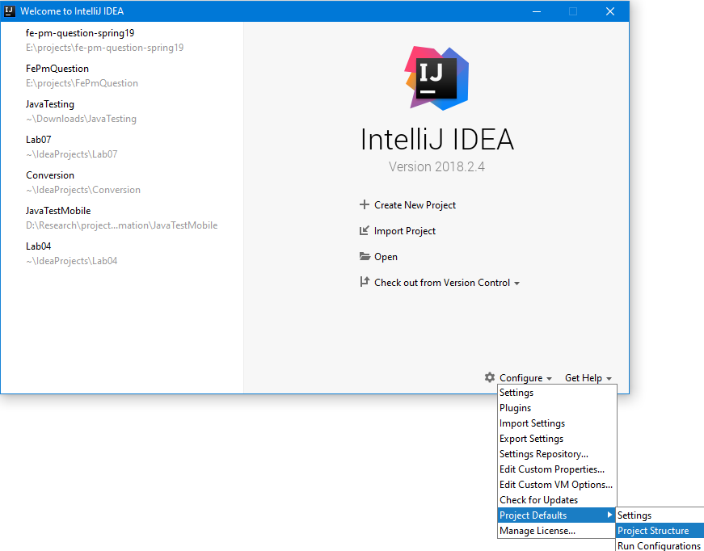
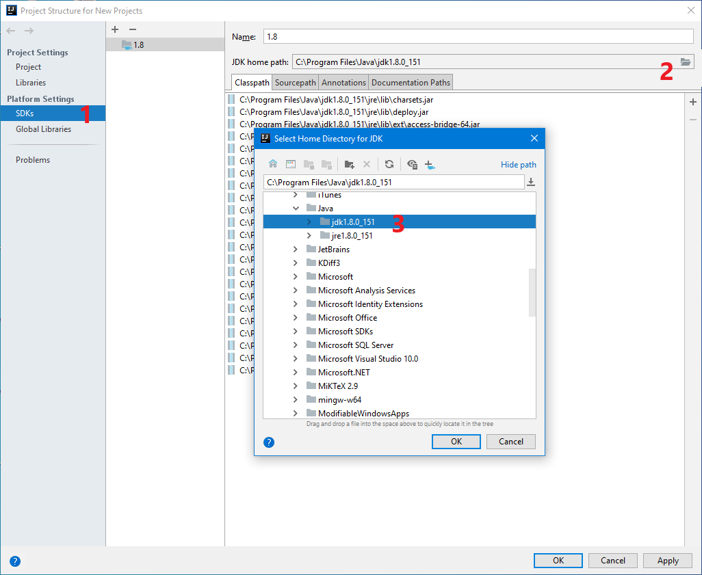
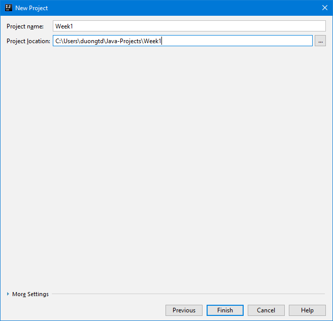
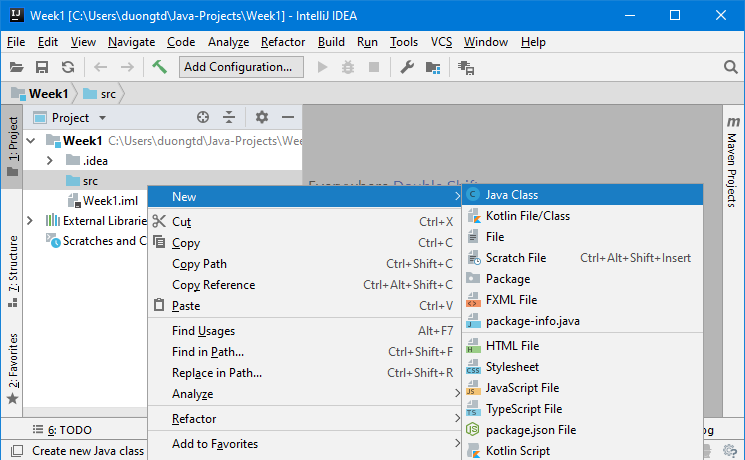
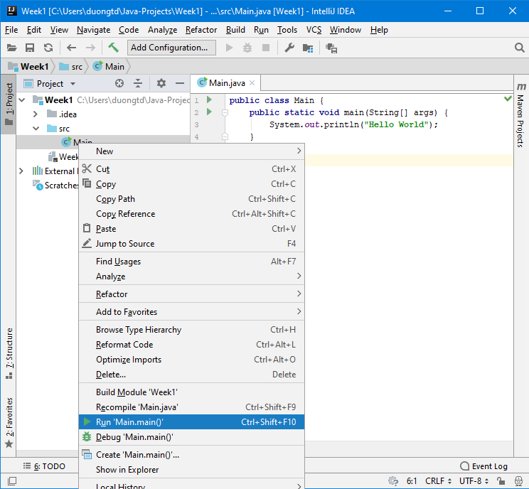

### Đề bài :

_Từ tuần 2, khuyến khích sử dụng IDE (ví dụ Intellij) để code thay vì code, biên dịch và thực thi trên command line. Các hướng dẫn trong đây đều mặc định với IDE Intellij._

Để thể hiện cho đối tượng con người, mã nguồn lớp Person dưới đây được cài đặt minh hoạ. Nó đơn giản bao gồm một thuộc tính name – là tên người; 2 phương thức khởi tạo, 1 không có tham số, và 1 có tham số là tên người; getter/setter cho thuộc tính name. Chi tiết thể hiện trong comment mã nguồn.

```java
public class Person {
    String name; // thuộc tính name
    
    // phương thức khởi tạo không tham số
    public Person() {
    }
    
    // phương thức khởi tạo 1 tham số (name)
    public Person(String name) {
        this.name = name;
    }
    
    // getter cho thuộc tính name
    public String getName() {
        return name;
    }
    
    // setter cho thuộc tính name
    public void setName(String name) {
        this.name = name;
    }
}
```

Sau khi đã đọc hiểu ví dụ bên trên, hãy tự cài đặt lớp Student theo yêu cầu cụ thể dưới đây.

1. Tạo lớp **Student** với các thuộc tính kiểu String, mức truy nhập private gồm: **name** (tên sinh viên), **id** (mã số sinh viên), **group** (lớp học), **email** (địa chỉ email).

2. Thêm các phương thức get/set cho các thuộc tính (gọi là getter/setter). Ví dụ, với thuộc tính “name”, hai phương thức cần thêm gồm “**public String getName()**” và “**public void setName(String n)**”.

3. Tạo đối tượng Student có tên là _Nguyen Van An_, id là _17020001_, lớp _K62CC_, email _17020001@vnu.edu.vn_.  
Thêm phương thức “**String getInfo()**” cho lớp Student. Phương thức này trả về tên, mã số SV, lớp, và email của sinh viên theo đúng định dạng sau:

    `Nguyen Van An – 17020001 – K62CC – 17020001@vnu.edu.vn`

4. Thêm 3 phương thức khởi tạo cho lớp Student

   - Phương thức khởi tạo không có tham số: **Student()**. Nếu khởi tạo bằng phương thức này, sinh viên được tạo ra sẽ có giá trị cho các thuộc tính như sau: name = “Student”, id=“000”, group=“K62CB”, email = “uet@vnu.edu.vn”

   - Phương thức khởi tạo có tham số **Student(String name, String id, String email)**. Khởi tạo bằng phương thức này sẽ có sinh viên với các thuộc tính “name”, “id”, và “email” là các giá trị từ tham số, còn “group” có giá trị là “K62CB”.

   - Phương thức khởi tạo sao chép **Student(Student s)**. Với phương thức này, đối tượng tạo ra sẽ có các thuộc tính với trị giống như của đối tượng s.

5. Tạo thêm lớp **StudentManagement** (tự tạo phương thức **main()** để kiểm tra các chức năng cài đặt bên trên). Trong lớp StudentMangement, viết một phương thức “**public static boolean sameGroup(Student s1, Student s2)**” để kiểm tra xem hai sinh viên s1 và s2 có cùng lớp hay không.

6. Sửa lại lớp StudentManagement để lớp này có một thuộc tính students là array (không dùng List) chứa các đối tượng thuộc lớp Student (max. 100) có tên **students**. Viết phương thức **public void addStudent(Student newStudent)** để thêm mới một Student vào mảng.

7. Viết phương thức “**public String studentsByGroup()**” cho lớp StudentManagement trả về chuỗi in danh sách sinh viên theo lớp tuân theo định dạng sau (lưu ý lớp sắp xếp theo thứ tự xuất hiện đầu tiên, sinh viên sắp xếp theo thứ tự thêm vào):

    ```
    K62CC
    Nguyen Van An - 17020001 – K62CC – 17020001@vnu.edu.vn
    Nguyen Van B - 17020002 – K62CC – 17020002@vnu.edu.vn
    K62CB
    Nguyen Van C - 17020003 – K62CB – 17020003@vnu.edu.vn
    Nguyen Van D - 17020004 – K62CB – 17020004@vnu.edu.vn
    ```
    
    Thứ tự thêm sinh viên ở trên là An, B, C, D (thêm sinh viên bằng phương thức addStudent).
    
    Chú ý: sử dụng ký tự `\n` để xuống dòng khi in chuỗi.

8. Viết phương thức “**public void removeStudent(String id)**” cho lớp StudentManagement để xóa sinh viên với mã số là id ra khỏi danh sách.

Hướng dẫn: Sau khi đã tải và cài đặt Intellij, nếu chạy lần đầu, cần config đường dẫn tới JDK đã cài đặt ở tuần 1:

6. Click _Configure -> Project Defaults -> Project Structure_

    

7. Cửa sổ mới hiện lên, bên trái chọn _SDKs_; bên phải click để chọn đường dẫn tới _JDK home path_. Sau khi chọn thành công click _OK_ để ghi nhận.

    

Như vậy là đã config xong, lưu ý việc này chỉ tiến hành 1 lần, các lần sau không cần làm lại.

Tiếp theo, để tạo mới project, click vào _Create New Project_ ở cửa sổ đầu tiên, tiếp đó 2 lần để nguyên mặc định và click _Next_, _Next_ (2 lần). Ở cửa sổ cuối cùng, yêu cầu điền tên project và nơi lưu mã nguồn tương ứng. Sau khi hoàn thành, click _Finish_ để xác nhận tạo mới project.



Tạo mới lớp Student bằng cách: right click _src -> New -> Java Class_; sau đó đặt tên cho class là Student và click _OK_. Tự hoàn thiện các yêu cầu còn lại.



Để chạy chương trình, right click class chứa phương thức _main_ cần chạy, chọn _Run_ (hoặc _Debug_)



### Định dạng đầu vào :

1. Các file .java nộp lên **không định danh package** trong đó (bỏ tất cả dòng pakage)
2. Tất cả **file .java** đặt **cùng trong một folder** và được nén lại dưới đuôi .zip
3. **Tên folder** chứa các **file .java** không được chứa ký tự đặc biệt hoặc ký tự khoảng trắng.

### Source code mẫu :

https://github.com/uetoop/OOPSummer2018/tree/master/StudentManagement

### Điều kiện :

None