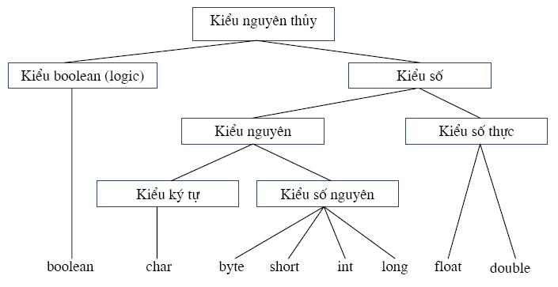
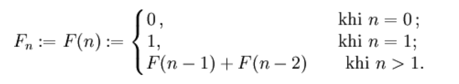

### Đề bài :

Các kiểu dữ liệu trong Java được thể hiện như hình dưới:

_Các kiểu dữ liệu trong Java – nguồn javatpoint.com_

Viết các phương thức sau, sử dụng code mẫu tại https://github.com/oasis-homework/Week3/blob/main/Solution.java

Xây dựng lớp `Solution` có chứa phương thức `fibonacci(long n)` để tính số thứ **n** trong dãy Fibonacci. Phương thức có kiểu trả về là `long`, mức truy nhập `public`. Công thức được tính như sau:

Trường hợp n < 0, hàm trả về giá trị `-1`  
Trường hợp số Fibonacci thứ **n** vượt quá giá trị lớn nhất của kiểu dữ liệu `long`, phương thức trả về giá trị `Long.MAX_VALUE`.

### Định dạng đầu vào :

Số tự nhiên n

### Định dạng đầu ra :

Số Fibonacci thứ n.

### Source code mẫu :

None

### Điều kiện :

n là số tự nhiên, n <=100