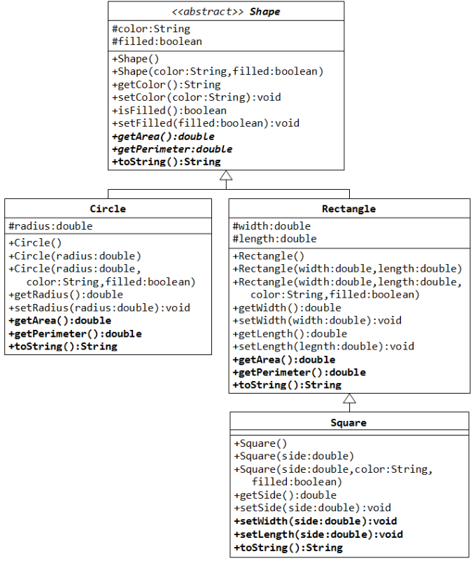

### Đề bài :

Đa hình trong Java được hiểu là một đối tượng có thể có nhiêu hình thức, kiểu khác nhau. Đầu tiên để hiểu được đa hình, khái niệm up-casting sẽ được làm rõ. Up-casting là khả năng nhìn nhận đối tượng thuộc con như là một đối tượng thuộc lớp cha. Vẫn sử dụng lại ví dụ ở tuần 5 về 2 lớp Person và Student, trong đó Student kế thừa Person, đoạn code dưới đây minh hoạ rõ về up-casting. _Lưu ý, những đoạn code không liên quan được bỏ qua, không thể hiện tất cả ở đây._

```java
public class Student extends Person {

    ... // bỏ qua code cũ

  public static void main(String[] args) {
    // up-casting, biến person của lớp Person (lớp cha) tham chiếu tới đối tượng của lớp Student (lớp con)
    Person person = new Student(20, "An", "18020000");
  }
}
```

Bây giờ, thêm vào lớp Person phương thức printType() để in ra đây là đối tượng thuộc lớp Person; đồng thời, lớp Student override phương thức này, in ra đây là đối tượng thuộc lớp Student. Code sau khi đã chỉnh sửa có dạng như dưới đây.

```java
public class Person {

    ... // bỏ qua code cũ

    public void printType() {
        System.out.println("This is a person");
    }
}

public class Student extends Person {

    ... // bỏ qua code cũ

    public void printType() {
        System.out.println("This is a student");
    }

    public static void main(String[] args) {
        // up-casting, biến person của lớp Person (lớp cha) tham chiếu tới đối tượng của lớp Student (lớp con)
        Person person = new Student(20, "An", "18020000");
        person.printType(); // This is a student
    }
}
```

Khi thực thi hàm main bên trên, chương trình sẽ in ra “This is a student”. Điều đó có nghĩa là dù ta gọi phương thức printType() bởi biến tham chiếu person thuộc lớp Person (lớp cha), phương thức ghi đè printType() thuộc lớp Student (lớp con) vẫn được gọi tới. Đó chính là tính đa hình trong Java.

Tiếp theo, trong Java cung cấp toán tử instanceof để kiểm tra xem đối tượng có là instance của kiểu cụ thể: lớp hoặc lớp con hoặc interface hay không. Nó trả về true hoặc false. Ví dụ dưới đây minh hoạ cụ thể về toán tử này.

```java
Person person = new Student(20, "An", "18020000");
boolean b1 = person instanceof Person; // true
boolean b2 = person instanceof Student; // true

Person person2 = new Person();
boolean b3 = person2 instanceof Person; // true
boolean b4 = person2 instanceof Student; // false
```

Tính trừu tượng (Abstraction) trong Java hướng đến khả năng tạo một đối tượng trừu tượng trong lập trình hướng đối tượng. Một lớp trừu tượng (abstract class) là một lớp mà không thể được khởi tạo. Tất cả các chức năng khác của lớp, thuộc tính, phương thức, và hàm khởi tạo đều giống với lớp thông thường. Chỉ khác là ta không thể tạo một đối tượng với một lớp trừu tượng hóa. Trong Java, ta sử dụng từ khóa abstract để khai báo một lớp abstract. Từ khóa này xuất hiện trước từ khóa class trong khai báo lớp.

Trong ví dụ dưới đây, lớp Bank là 1 lớp trừu tượng (không thể khởi tạo đối tượng Bank), lớp này có khai báo 1 phương thức trừu tượng là getRateOfInterest() – trả về lãi suất của bank tương ứng. Vì chưa rõ là loại ngân hàng nào, lãi suất này với mỗi ngân hàng khác nhau là khác nhau, nên phương thức này cần khai báo kiểu trừu tượng mà không cài đặt ngay. 2 lớp VCB (Vietcombank) và BIDV kế thừa lớp Bank. Vì vậy chúng bắt buộc phải cài đặt phương thức getRateOfInterest(). Đây chính là ý nghĩa của trừu tượng trong Java.

```java
public abstract class Bank {
    abstract double getRateOfInterest();
}
```

```java
public class BIDV extends Bank {
    @Override
    double getRateOfInterest() {
        return 7.2;
    }
}
```

```java
public class TestBank {
    public static void main(String[] args) {
        Bank bank = new BIDV();
        double interest = bank.getRateOfInterest();
        System.out.println("Ti le lai suat la: " + interest + " %");
    }
}
```

```java
public class VCB extends Bank {
    @Override
    double getRateOfInterest() {
        return 7.1;
    }
}
```

```java
public class TestBank {
    public static void main(String[] args) {
    Bank bank = new VCB();
    double interest = bank.getRateOfInterest();
    System.out.println("Ti le lai suat la: " + interest + " %");
    }
}
```
Lỗi sẽ xảy ra nếu ta cố tình khởi tạo trực tiếp đối tượng từ lớp Bank (thay vì lớp con của nó).

`Bank b2 = new Bank(); // error`

**Yêu cầu:** Dựa vào hướng dẫn bên trên, hãy cài đặt các lớp theo biếu đồ dưới đây.



Một vài điều lưu ý sau đây:

1. Các thuộc tính với dấu # thể hiện mức truy nhập _protected_

2. Shape là abstract class, có 2 phương thức abstract là _getArea()_ và _getPerimeter()_ lần lượt tương ứng trả về diện tích và chu vi của hình đó.

3. Không tạo thêm bất kỳ thuộc tính nào ở lớp _Square_, tái sử dụng lại 2 thuộc tính _width_ và _length_ của lớp _Rectangle_. Chú ý override lại hai phương thức _setWidth()_ và _setLength()_ cho lớp _Square_ để có thể cập nhật đồng thời cả 2 giá trị "chiều dài" và "chiều rộng" cho các đối tượng hình vuông.

4. Các phương thức _toString()_ của 4 lớp _Shape, Circle, Rectangle, Square_ quy định như sau:

    - Shape[color=?,filled=?]
    - Circle[radius=?,color=?,filled=?]
    - Rectangle[width=?,length=?,color=?,filled=?]
    - Square[side=?,color=?,filled=?]

- Xem xét đoạn code dưới đây, trước khi test chạy thử, hãy tìm và dự đoán xem dòng nào sẽ báo lỗi, và kịch bản in ra sẽ như thế nào. _Lưu ý, có thể 1 số câu lệnh có lỗi syntax, dẫn đến compile error:_

```java
Shape s1 = new Circle(5.5, "RED", false);
System.out.println(s1);
System.out.println(s1.getArea());
System.out.println(s1.getPerimeter());
System.out.println(s1.getColor());
System.out.println(s1.isFilled());
System.out.println(s1.getRadius());

Circle c1 = (Circle)s1;
System.out.println(c1);
System.out.println(c1.getArea());
System.out.println(c1.getPerimeter());
System.out.println(c1.getColor());
System.out.println(c1.isFilled());
System.out.println(c1.getRadius());

Shape s2 = new Shape();

Shape s3 = new Rectangle(1.0, 2.0, "RED", false);
System.out.println(s3);
System.out.println(s3.getArea());
System.out.println(s3.getPerimeter());
System.out.println(s3.getColor());
System.out.println(s3.getLength());

Rectangle r1 = (Rectangle)s3;
System.out.println(r1);
System.out.println(r1.getArea());
System.out.println(r1.getColor());
System.out.println(r1.getLength());

Shape s4 = new Square(6.6);
System.out.println(s4);
System.out.println(s4.getArea());
System.out.println(s4.getColor());
System.out.println(s4.getSide());

Rectangle r2 = (Rectangle)s4;
System.out.println(r2);
System.out.println(r2.getArea());
System.out.println(r2.getColor());
System.out.println(r2.getSide());
System.out.println(r2.getLength());

Square sq1 = (Square)r2;
System.out.println(sq1);
System.out.println(sq1.getArea());
System.out.println(sq1.getColor());
System.out.println(sq1.getSide());
System.out.println(sq1.getLength());
```

### Định dạng đầu vào :

1. Các file .java nộp lên **không định danh package** trong đó (bỏ tất cả dòng pakage)
2. Tất cả **file .java** đặt **cùng trong một folder** và được nén lại dưới đuôi .zip
3. **Tên folder** chứa các **file .java** không được chứa ký tự đặc biệt hoặc ký tự khoảng trắng.

### Source code mẫu :

None