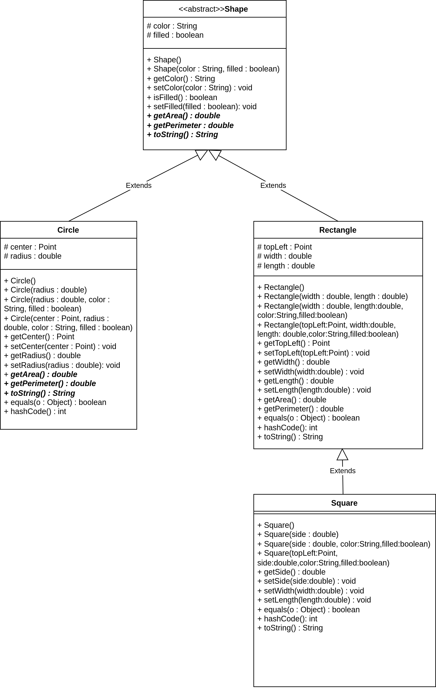
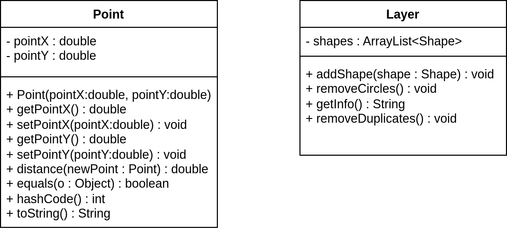

### Đề bài :




Tiếp tục từ bài buổi trước, **quan sát biểu đồ lớp trên đây**, hãy:

- Định nghĩa thêm lớp **Point** như biểu đồ lớp. Phương thức _distance()_ dùng để tính khoảng cách giữa 2 đối tượng **Point**. Phương thức _toString()_ trả về thông tin có định dạng:
    ```
    (1,2)
    ```
- Thêm các thuộc tính _center_ cho lớp **Circle**, _topLeft_ cho lớp **Rectangle**

- Thêm các constructor có bổ sung tham số mới cho các lớp **Circle**, **Rectangle**, **Square**

- Cập nhật giá trị trả về của phương thức _toString()_ cho các lớp **Circle**, **Rectangle**, **Square** như sau:

    ```
    // Giá trị double in ra làm tròn đến chữ số thập phân thứ nhất
    
    // Circle
    Circle[center=(10.0,5.0),radius=8.0,color=RED,filled=true]
    
    // Rectangle
    Rectangle[topLeft=(10.0,5.0),width=8.0,length=6.0,color=RED,filled=true]
    
    // Square
    Square[topLeft=(10.0,5.0),side=8.0,color=RED,filled=true]
    ```

- Cài đặt các phương thức _equals()_ cho các lớp **Circle**, **Rectangle**, **Square**. Sai số cho phép khi so sánh các giá trị double là `0.001`

- Định nghĩa lớp **Layer** chứa danh sách các đối tượng **Shape**

    - Cài đặt phương thức _addShape()_ để thêm 1 hình vào layer
  
    - Cài đặt phương thức _getInfo()_ trả về thông tin các hình trong 1 layer theo định dạng (hình nào thêm trước thì hiện lên trước):
  
    ```
    Layer of crazy shapes: 
    Circle[center=(10.0,5.0),radius=8.0,color=RED,filled=true]
    Rectangle[topLeft=(10.0,5.0),width=8.0,length=6.0,color=RED,filled=true]
    Circle[center=(10.0,5.0),radius=8.0,color=RED,filled=true]
    Square[topLeft=(10.0,5.0),side=8.0,color=RED,filled=true]
    ```
  
    - Cài đặt phương thước _removeCircles()_ để xóa tất cả hình tròn trong layer
  
    - Cài phương thức _removeDuplicates()_ để xóa các hình trùng nhau trong một Layer (ví dụ: với Circle, 2 hình trùng nhau sẽ tọa độ tâm và độ lớn bán kính như nhau). Chú ý không so sánh dựa trên thuộc tính _color_ và _filled_, lúc xóa thì xóa những hình được thêm vào sau. Gợi ý: Bạn có thể tự cài đặt thuật toán hoặc dùng Lambda Expression hoặc Set. Đối với cách thứ 2 bạn cần cài đặt phương thức _hashCode()_ cho các đối tượng cần so sánh.

### Định dạng đầu vào :

1. Các file .java nộp lên **không định danh package** trong đó (bỏ tất cả dòng pakage)
2. Tất cả **file .java** đặt **cùng trong một folder** và được nén lại dưới đuôi .zip
3. **Tên folder** chứa các **file .java** không được chứa ký tự đặc biệt hoặc ký tự khoảng trắng.
