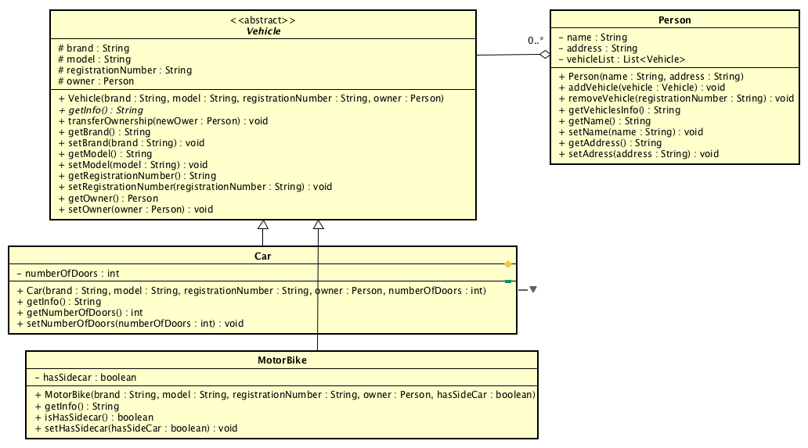

### Đề bài :

Cài đặt các lớp **Vehicle**, **Car**, **MotorBike**, **Person** dựa theo biểu đồ lớp dưới đây:



1. Tạo các lớp, thuộc tính, getter, setter, constructor như biểu đồ lớp

2. Phương thức **getInfo()** khai báo ở lớp **Vehicle** là _abstract_. Cài đặt bản ghi đè cho phương thức này ở các lớp **Car** và **MotorBike** trả về kiểu dữ liệu **String** theo định dạng lần lượt như các ví dụ dưới đây:

    Lớp **Car**:
  
    ```
    Car:
      Brand: Mercedes-Benz
      Model: S400
      Registration Number: 30A - 888.88
      Number of Doors: 4
      Belongs to Nguyen Van A - 144 Xuan Thuy, Cau Giay, HN
    ```
  
    Lớp **MotorBike**:
  
    ```
    Motor Bike:
      Brand: Yamaha
      Model: YZF-R6
      Registration Number: 29 - P1 686.68
      Has Side Car: false
      Belongs to Nguyen Van A - 144 Xuan Thuy, Cau Giay, HN
    ```

3. Trong lớp **Person** khai báo thuộc tính **vehicleList** có kiểu dữ liệu _List\<Vehicle\>_ để chứa danh sách phương tiện mà người này sở hữu. Cài đặt các phương thức **addVehicle()** và **removeVehicle()** để thêm và xóa phương tiện của người này.

4. Trong lớp **Person** cài đặt phương thức **getVehiclesInfo()** để lấy ra dữ liệu các phương tiện mà người này sở hữu. Phương thức trả về kiểu dữ liệu **String** theo định dạng lần lượt như các ví dụ dưới đây:

    a. Nếu không có phương tiện nào thì trả về theo định dạng:

    ```
    Nguyen Van A has no vehicle!
    ```
   
    b. Nếu danh sách phương tiện không rỗng thì trả về theo định dạng:
    
    ```
    Nguyen Van A has:

    Car:
      Brand: Mercedes-Benz
      Model: S400
      Registration Number: 30A - 888.88
      Number of Doors: 4
      Belongs to Nguyen Van A - 144 Xuan Thuy, Cau Giay, HN
    Motor Bike:
      Brand: Yamaha
      Model: YZF-R6
      Registration Number: 29 - P1 686.68
      Has Side Car: false
      Belongs to Nguyen Van A - 144 Xuan Thuy, Cau Giay, HN
    ```
   
5. Trong lớp **Vehicle** cài đặt phương thức **transferOwnership()** để chuyển quyền sở hữu phương tiện sang người khác

Lưu ý: 1 kí tự **"\t"** bằng **4 kí tự space**

### Định dạng đầu vào :

1. Các file .java nộp lên **không định danh package** trong đó (bỏ tất cả dòng pakage)
2. Tất cả **file .java** đặt **cùng trong một folder** và được nén lại dưới đuôi .zip
3. **Tên folder** chứa các **file .java** không được chứa ký tự đặc biệt hoặc ký tự khoảng trắng.

### Source code mẫu :

None

### Điều kiện :

None